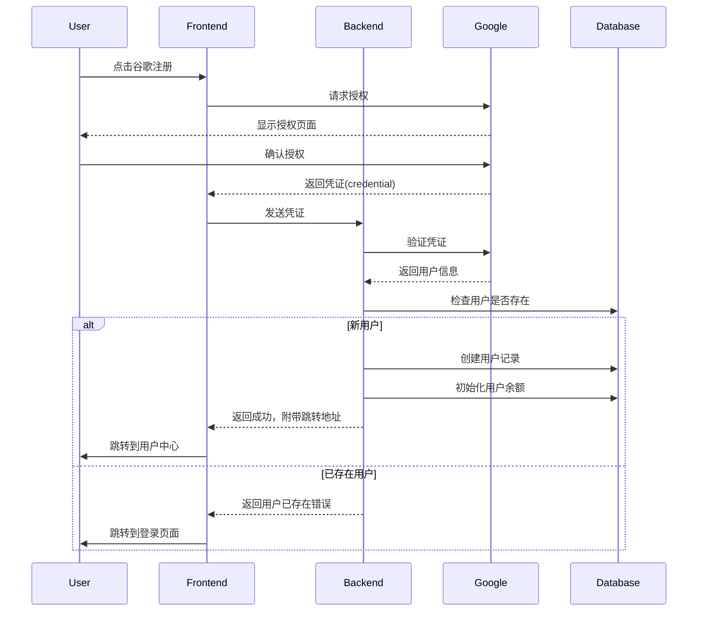

# 在Web应用中集成Google登录指南
# 在 Web 应用中集成 Google 登录指南
## 1. 前期准备
### 1.1 创建 Google Cloud 项目
1. 访问 Google Cloud Console
2. 创建新项目或选择现有项目
3. 启用 Google Sign-In API
### 1.2 配置 OAuth 2.0
1. 在 Google Cloud Console 中:
   - 导航到"API和服务" > "凭据"
   - 创建 OAuth 2.0 客户端 ID
   - 选择应用类型为"Web 应用程序"
   - 添加授权来源： http://localhost:8080
   - 添加重定向 URI： http://localhost:8080/google-register
## 2. 后端实现 (FastAPI)
### 2.1 安装依赖
```bash
pip install fastapi google-auth
```
### 2.2 后端代码实现

```python
from fastapi import APIRouter, Form, Request, HTTPException
from google.oauth2 import id_token
from google.auth.transport import requests

router = APIRouter()

GOOGLE_CLIENT_ID = 'YOUR_CLIENT_ID'

@router.post("/google-register")
async def google_register(
    request: Request,
    credential: str = Form(...),
):
    try:
        # 验证 Google token
        idinfo = id_token.verify_oauth2_token(
            credential, 
            requests.Request(), 
            GOOGLE_CLIENT_ID
        )

        # 获取用户信息
        email = idinfo['email']
        name = idinfo.get('name', email.split('@')[0])
        google_id = idinfo['sub']

        # 检查用户是否已存在
        existing_user = DBService.get_user_by_email(email)
        if existing_user:
            if existing_user.get('is_google_user'):
                request.session["user"] = existing_user
                return {"success": True, "redirect_url": "/dashboard"}
            raise HTTPException(status_code=400, detail="邮箱已被注册")

        # 创建新用户
        user_id = DBService.create_user(
            username=name,
            email=email,
            password=None,
            is_google_user=True
        )

        if not user_id:
            raise HTTPException(status_code=500, detail="用户创建失败")

        # 自动登录
        user = DBService.get_user_by_email(email)
        request.session["user"] = user

        return {"success": True, "redirect_url": "/dashboard"}

    except ValueError as e:
        raise HTTPException(status_code=400, detail=str(e))
    except Exception as e:
        raise HTTPException(status_code=500, detail=str(e))
```

## 3. 前端实现
### 3.1 HTML 模板
```html
<!DOCTYPE html>
<html>
<head>
    <title>注册</title>
    <style>
        .google-auth {
            margin-top: 20px;
            text-align: center;
        }
    </style>
</head>
<body>
    <!-- Google 登录按钮 -->
    <div class="google-auth">
        <div id="g_id_onload"
             data-client_id="YOUR_CLIENT_ID"
             data-callback="handleGoogleRegister"
             data-auto_prompt="false">
        </div>
        <div class="g_id_signin"
             data-type="standard"
             data-size="large"
             data-theme="outline"
             data-text="使用谷歌账号注册"
             data-shape="rectangular"
             data-logo_alignment="left">
        </div>
    </div>

    <!-- Google Sign-In API -->
    <script src="https://accounts.google.com/gsi/client" async defer></script>
    <script>
        function handleGoogleRegister(response) {
            const formData = new FormData();
            formData.append('credential', response.credential);
            
            fetch('/google-register', {
                method: 'POST',
                headers: {
                    'Accept': 'application/json',
                },
                body: formData
            }).then(response => {
                if (!response.ok) {
                    return response.json().then(error => {
                        throw new Error(error.detail || '注册失败');
                    });
                }
                return response.json();
            }).then(data => {
                if (data.success && data.redirect_url) {
                    window.location.href = data.redirect_url;
                }
            }).catch(error => {
                alert(error.message || '注册过程中发生错误');
            });
        }
    </script>
</body>
</html>
```
## 4. 数据库设计
```sql
CREATE TABLE users (
    id VARCHAR(36) PRIMARY KEY,
    username VARCHAR(255) NOT NULL,
    email VARCHAR(255) UNIQUE NOT NULL,
    password_hash VARCHAR(255),
    is_google_user BOOLEAN DEFAULT FALSE,
    google_id VARCHAR(255),
    created_at TIMESTAMP DEFAULT CURRENT_TIMESTAMP
);
```
## 5. 常见问题和解决方案
### 5.1 重定向 URI 不匹配
错误信息： Error 400: redirect_uri_mismatch 解决方案：

- 确保 Google Cloud Console 中配置的重定向 URI 与应用完全匹配
- 检查协议（http/https）、域名、端口号是否一致
- 确保没有多余的斜杠
### 5.2 客户端 ID 无效
错误信息： Invalid client_id 解决方案：

- 检查前端配置的 client_id 是否正确
- 确保已在 Google Cloud Console 中启用了相应的 API
### 5.3 回调函数未执行
问题：Google 登录成功但回调函数没有触发
解决方案：

- 移除 data-ux_mode="redirect" 配置
- 确保回调函数名称与 data-callback 属性值匹配
- 检查浏览器控制台是否有错误信息
### 5.4 CORS 错误
问题：跨域请求被阻止
解决方案：

- 在后端添加正确的 CORS 配置
- 确保前端请求使用正确的域名和端口
## 6. 安全建议
1. 始终在后端验证 Google Token
2. 使用 HTTPS 在生产环境中传输数据
3. 实现 CSRF 保护
4. 设置适当的 Session 过期时间
5. 定期轮换 Client Secret
6. 限制登录失败次数
## 7. 最佳实践
1. 添加加载状态提示
2. 实现优雅的错误处理
3. 提供清晰的用户反馈
4. 考虑添加"记住登录状态"功能
5. 实现账号关联功能
6. 提供退出登录选项
这样的集成可以大大简化用户的注册/登录流程，提高应用的用户体验。记得定期检查 Google API 的更新，以确保集成始终保持最新状态。


# FastAPI 集成 Google 登录实现文档

## 1. 模板文件
`src/templates/auth/register.html`

```html
<!DOCTYPE html>
<html lang="zh">
<head>
    <meta charset="UTF-8">
    <meta name="viewport" content="width=device-width, initial-scale=1.0">
    <title>注册 - 音频转写服务</title>
    <link href="/static/style.css" rel="stylesheet" type="text/css" />
    <style>
        .google-auth {
            margin-top: 20px;
            text-align: center;
        }

        .loading-overlay {
            display: none;
            position: fixed;
            top: 0;
            left: 0;
            width: 100%;
            height: 100%;
            background: rgba(0, 0, 0, 0.5);
            z-index: 1000;
        }

        .loading-spinner {
            position: absolute;
            top: 50%;
            left: 50%;
            transform: translate(-50%, -50%);
            color: white;
        }

        .or-divider {
            margin: 20px 0;
            text-align: center;
            position: relative;
        }

        .or-divider::before,
        .or-divider::after {
            content: '';
            position: absolute;
            top: 50%;
            width: 45%;
            height: 1px;
            background-color: #ddd;
        }

        .or-divider::before { left: 0; }
        .or-divider::after { right: 0; }
    </style>
</head>
<body>
    <!-- Google 登录按钮容器 -->
    <div class="google-auth">
        <div id="g_id_onload"
             data-client_id="YOUR_GOOGLE_CLIENT_ID"
             data-callback="handleGoogleRegister"
             data-auto_prompt="false">
        </div>
        <div class="g_id_signin"
             data-type="standard"
             data-size="large"
             data-theme="outline"
             data-text="使用谷歌账号注册"
             data-shape="rectangular"
             data-logo_alignment="left">
        </div>
    </div>

    <!-- Google Sign-In API -->
    <script src="https://accounts.google.com/gsi/client" async defer></script>
    <script>
        function handleGoogleRegister(response) {
            console.log('Google response:', response);
            
            const formData = new FormData();
            formData.append('credential', response.credential);
            
            console.log('Sending request to /google-register');
            
            fetch('/google-register', {
                method: 'POST',
                headers: {
                    'Accept': 'application/json',
                },
                body: formData
            }).then(response => {
                console.log('Response received:', response);
                if (!response.ok) {
                    return response.json().then(error => {
                        throw new Error(error.detail || '注册失败');
                    });
                }
                return response.json();
            }).then(data => {
                console.log('Data received:', data);
                if (data.success && data.redirect_url) {
                    window.location.href = data.redirect_url;
                }
            }).catch(error => {
                console.error('Error:', error);
                alert(error.message || '注册过程中发生错误');
            });
        }

        window.onload = function() {
            console.log('Page loaded, Google Sign-In initialized');
        }
    </script>
</body>
</html>
```
## 2. FastAPI 路由处理
src/api/auth.py
```python
from fastapi import APIRouter, Form, Request, HTTPException
from google.oauth2 import id_token
from google.auth.transport import requests

router = APIRouter()

GOOGLE_CLIENT_ID = 'YOUR_GOOGLE_CLIENT_ID'

@router.post("/google-register")
async def google_register(
    request: Request,
    credential: str = Form(...),
):
    try:
        # 验证 Google token
        idinfo = id_token.verify_oauth2_token(
            credential, 
            requests.Request(), 
            GOOGLE_CLIENT_ID
        )

        # 获取用户信息
        email = idinfo['email']
        name = idinfo.get('name', email.split('@')[0])
        google_id = idinfo['sub']

        # 检查用户是否已存在
        existing_user = DBService.get_user_by_email(email)
        if existing_user:
            if existing_user.get('is_google_user'):
                request.session["user"] = existing_user
                return {"success": True, "redirect_url": "/dashboard"}
            raise HTTPException(status_code=400, detail="邮箱已被注册")

        # 创建新用户
        user_id = DBService.create_user(
            username=name,
            email=email,
            password=None,
            is_google_user=True
        )

        if not user_id:
            raise HTTPException(status_code=500, detail="用户创建失败")

        # 自动登录
        user = DBService.get_user_by_email(email)
        request.session["user"] = user

        return {"success": True, "redirect_url": "/dashboard"}

    except ValueError as e:
        raise HTTPException(status_code=400, detail=str(e))
    except Exception as e:
        raise HTTPException(status_code=500, detail=str(e))
```
## 3. 数据库服务
src/services/mongodb_service.py
```python
from datetime import datetime
import bcrypt
from bson import ObjectId

class MongoDBService:
    @staticmethod
    def create_user(username: str, email: str, password: str = None, is_google_user: bool = False) -> str:
        try:
            # 检查用户是否存在
            if db.users.find_one({'email': email}):
                return None

            # 创建用户文档
            user_data = {
                'username': username,
                'email': email,
                'is_google_user': is_google_user,
                'created_at': datetime.now()
            }

            # 如果不是谷歌用户，添加密码哈希
            if not is_google_user and password:
                user_data['password_hash'] = bcrypt.hashpw(
                    password.encode('utf-8'), 
                    bcrypt.gensalt()
                )

            result = db.users.insert_one(user_data)
            return str(result.inserted_id)
        except Exception as e:
            print(f"创建用户失败: {str(e)}")
            return None

    @staticmethod
    def get_user_by_email(email: str) -> dict:
        try:
            user = db.users.find_one({'email': email})
            if not user:
                return None
                
            return {
                'id': str(user['_id']),
                'username': user['username'],
                'email': user['email'],
                'is_google_user': user.get('is_google_user', False)
            }
        except Exception as e:
            print(f"获取用户失败: {str(e)}")
            return None
```

## 4. 配置说明

- 替换 YOUR_GOOGLE_CLIENT_ID 为您的 Google Cloud Console 中获取的客户端 ID
- 确保已在 Google Cloud Console 中配置了正确的重定向 URI
- 添加必要的依赖项到 requirements.txt:
```plaintext
google-auth
bcrypt
 ```

